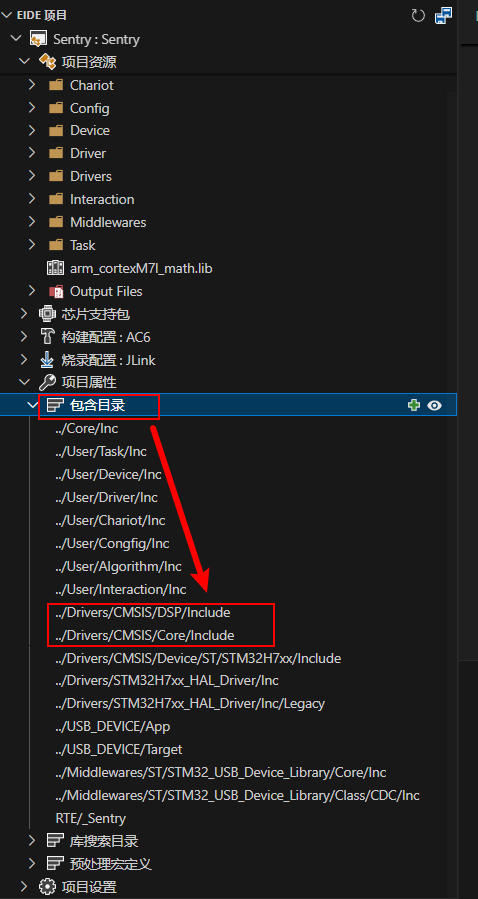
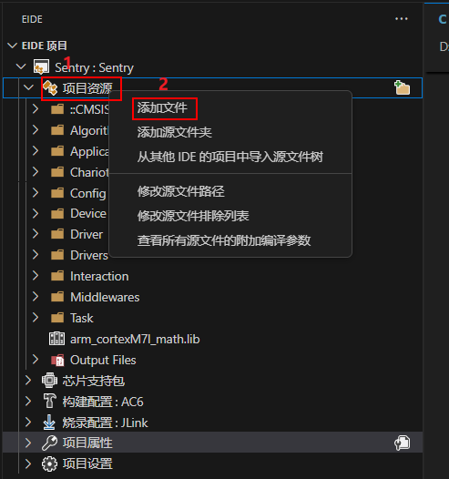
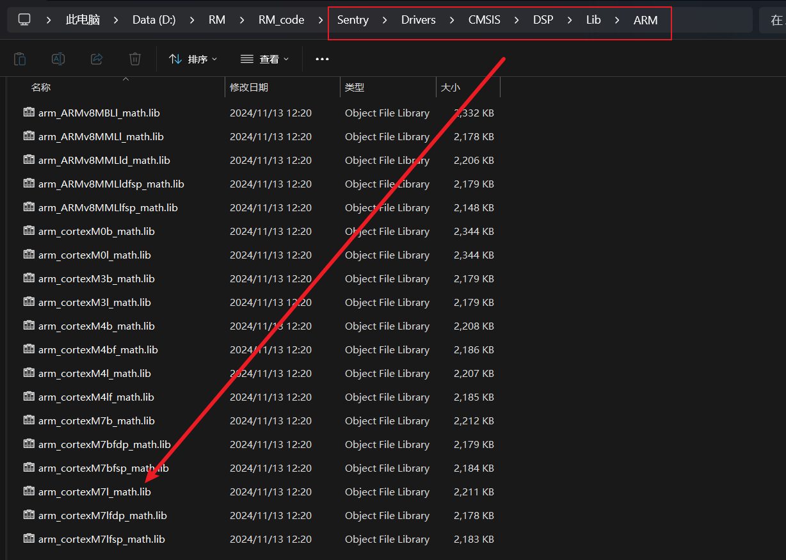
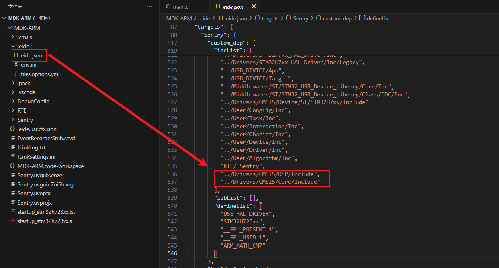
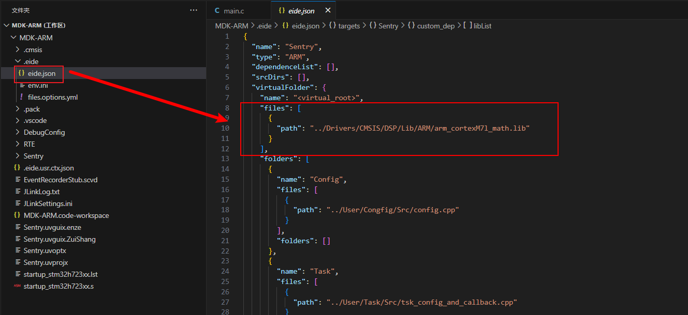

# EIDE 使用注意事项
- ## 手动添加include路径，否则插件无法找到头文件。  
  > ### 在EIDE插件内手动添加arm_math.h和core_cm7.h所在路径。
  > 解释：这两个头文件都是CMISIS的库头文件,在keil5的编译器默认路径下是存在的，所以在编译的时候，编译器会在编译器默认路径下寻找，不需要显式地包含，但是在EIDE的下是没有这个操作的，需要手动包含该工程Drivers/CMSIS文件夹，里面存放了该工程关于CMISIS的所有头文件。

  > 在包含目录里面添加路径   
  > 

- ## 手动添加lib路径，否则无法链接到库文件。
  > ### 在EIDE插件内手动添加arm_cortexM7l_math.lib
  > 解释：静态库文件，不参与编译，只参与链接，在所有源文件编译成目标文件之后，将所有目标文件与库文件进行链接，生成可执行文件，此时编译器会把静态库文件中的函数链接到可执行文件中，因此需要在编译器中指定静态库文件路径（默认路径除外，但是显然这个静态库不是keil所默认指定的，当然你也可以直接加到keil的默认路径下去一劳永逸，但是这样对编译这个工程的其他人就不友好了，所以还是把工程所有的非默认依赖都保存在工程中）。我们这里使用的是ARM官方提供的闭源的静态库，在CubMx里面就可以添加，默认在Drivers/CMSIS/DSP/Lib路径下。芯片架构是Cortex-M7，使用小端序，所以我们使用的是arm_cortexM7l_math.lib（其他的静态库文件也可以使用，但是要注意芯片架构和大小端序以及其他特殊需求）。

  > 第一步：右键添加文件  
  >   
  > 第二步：选择lib文件路径  
  > 

- ## eide的JSON配置如下   

### tips：重新导入Keil工程后，EIDE插件会自动更新JSON配置，这会导致我们之前的配置失效，所以需要手动更新JSON配置，这一点在其他没有额外配置的工程里面比较智能，但是对于我们这个工程来说比较麻烦，而且现在还没找都有找到好的解决方法，所以提醒一下，重新导入Keil工程后，需要手动更新JSON配置。